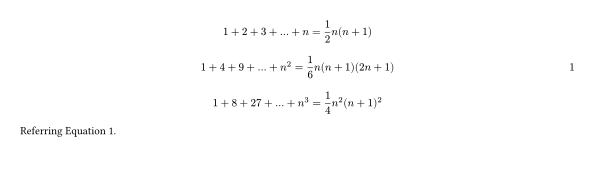
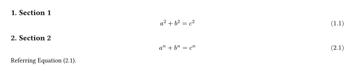

# typst-autoeqnum

Automatic equation numbering in [typst](https://typst.app/).
This is inspired by [autonum](https://ctan.org/pkg/autonum) package in LaTeX.

## Usage

Import and use with
```typst
#import "./autoeqnum.typ": autoeqnum
#show: autoeqnum.with()
```

Then, equation numbers are displayed only when their labels are referenced.

Example:

```typst
#import "./autoeqnum.typ": autoeqnum
#show: autoeqnum.with()

$ 1 + 2 + 3 + dots + n = 1/2 n(n+1) $ <label1>
$ 1 + 4 + 9 + dots + n^2 = 1/6 n(n+1)(2 n+1) $ <label2>
$ 1 + 8 + 27 + dots + n^3 = 1/4 n^2 (n+1)^2 $

Referring @label2.
```



## Options

- `mode`: Control when equation numbers are displayed.
  - `"always"`: All equations.
  - `"label"`: Equations with labels.
  - `"ref"`: Equations with referenced labels (default).
  - `"never"`: No equation labels are displayed.
- `numbering`: Passed to `math.equation(numbering)`.
  Do not set `math.equation(numbering)` directly when using `autoeqnum` package.

Example:

```typst
#import "./autoeqnum.typ": autoeqnum
#set heading(numbering: "1.")
#show heading.where(level: 2): set heading(level: 1)
#show heading.where(level: 2): it => {
	counter(math.equation).update(0)
	it
}
#show: autoeqnum.with(
	mode: "label", 
	numbering: it => {
		let count = counter(heading.where(level: 1)).get()
		numbering("(1.1)", ..count, it)
	}
)

== Section 1

$ a^2 + b^2 = c^2 $ <label1>

== Section 2

$ a^n + b^n = c^n $ <label2>

Referring @label2.
```


